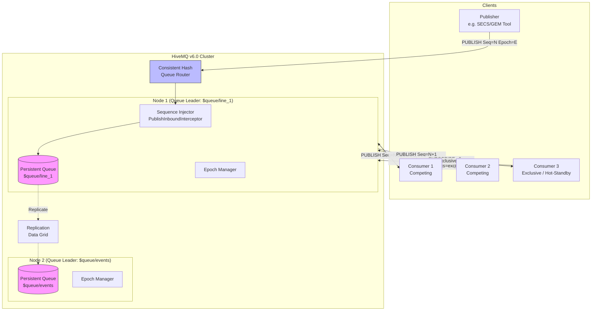
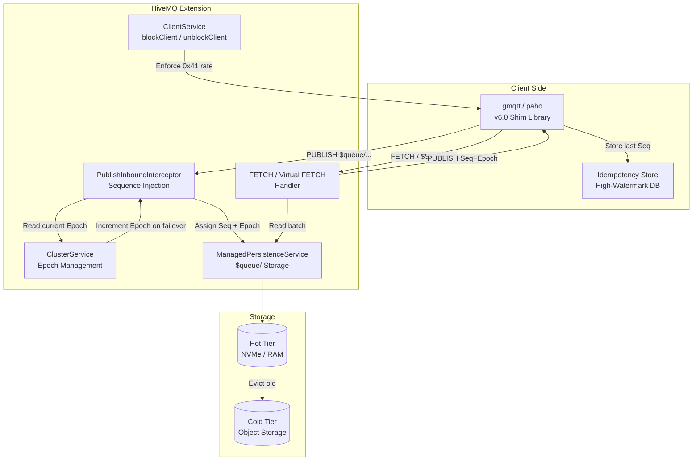

# MQTT v6.0 Architecture Diagrams

---

## 1. System Overview: MQTT v6.0 Stack

---

## 2. Feature Layer Architecture

```mermaid
graph LR
    subgraph v5["MQTT v5.0 Core (Unchanged)"]
        PUB[PUBLISH]
        SUB[SUBSCRIBE]
        CONN[CONNECT / CONNACK]
        QOS[QoS 0/1/2]
        PROPS[Properties System]
    end

    subgraph v6["MQTT v6.0 Extension Layer"]
        SEQ_PROP["Property 0x30<br/>Stream Sequence Number<br/>(32-bit)"]
        EPOCH_PROP["Property 0x35<br/>Stream Epoch<br/>(16-bit)"]
        RATE_PROP["Property 0x41<br/>Throughput Limit<br/>(KB/s)"]
        BATCH_PROP["Property 0x42<br/>Batch Size"]
        FETCH_PKT["Packet Type 16<br/>FETCH<br/>(Native Mode)"]
        QUEUE_NS["$queue/ Namespace<br/>Persistent Named Queues"]
        SQMC["SQMC Semantics<br/>Competing / Exclusive"]
        VFETCH["Virtual FETCH<br/>$SYS/queues/{n}/fetch<br/>(Compat Mode)"]
    end

    subgraph compat["Compatibility Layer"]
        SHIM["v6-seq / v6-epoch<br/>User Properties<br/>(v5.0 Brokers)"]
        HANDSHAKE["mqtt-ext: v6.0<br/>CONNECT Negotiation"]
    end

    v5 --> v6
    v6 -.->|fallback| compat
```

---

## 3. Component Roles in a HiveMQ Deployment

---

## 4. Property ID Map

```mermaid
block-beta
    columns 4
    block:v5_props["MQTT v5.0 Properties (selected)"]:4
        p01["0x01 Payload Format"]
        p02["0x02 Message Expiry"]
        p03["0x03 Content Type"]
        p08["0x08 Response Topic"]
        p09["0x09 Correlation Data"]
        p0b["0x0B Subscription ID"]
        p11["0x11 Session Expiry"]
        p12["0x12 Assigned Client ID"]
        p15["0x15 Auth Method"]
        p16["0x16 Auth Data"]
        p17["0x17 Request Problem Info"]
        p19["0x19 Request Response Info"]
        p1a["0x1A Server Reference"]
        p1c["0x1C Reason String"]
        p21["0x21 Receive Maximum"]
        p22["0x22 Topic Alias Max"]
        p23["0x23 Topic Alias"]
        p24["0x24 Maximum QoS"]
        p25["0x25 Retain Available"]
        p26["0x26 User Property"]
        p27["0x27 Maximum Packet Size"]
        p28["0x28 Wildcard Sub Available"]
        p29["0x29 Subscription ID Available"]
        p2a["0x2A Shared Sub Available"]
    end
    block:v6_props["MQTT v6.0 NEW Properties"]:4
        n30["0x30 ★ Stream Sequence (4B)"]
        n35["0x35 ★ Stream Epoch (2B)"]
        n36["0x36 ★ Wait Timeout (2B)"]
        n41["0x41 ★ Throughput Limit (4B)"]
        n42["0x42 ★ Batch Size (4B)"]
    end
    style n30 fill:#6f6,stroke:#333
    style n35 fill:#6f6,stroke:#333
    style n36 fill:#6f6,stroke:#333
    style n41 fill:#6f6,stroke:#333
    style n42 fill:#6f6,stroke:#333
```

