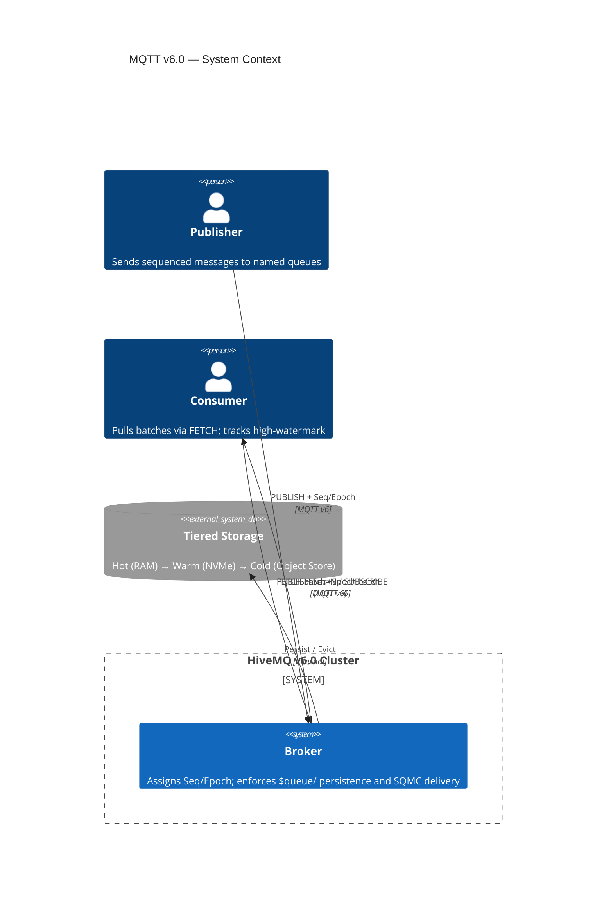
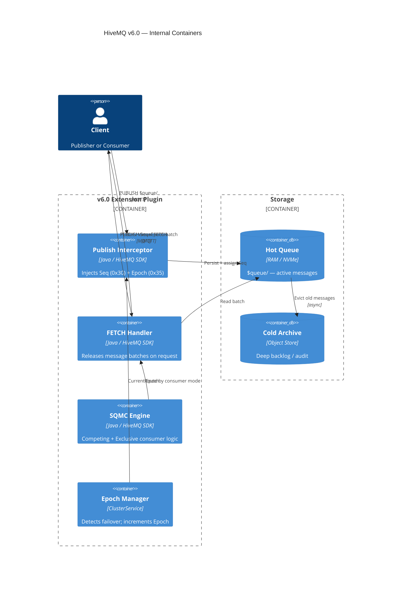

# MQTT v6.0 Architecture Diagrams

---

## 1. System Context (C4)

```mermaid
%%{init:{'theme':'base','themeVariables':{'primaryColor':'#FFD600','primaryTextColor':'#212121','primaryBorderColor':'#212121','lineColor':'#212121','secondaryColor':'#424242','tertiaryColor':'#FFF9C4','noteBkgColor':'#FFD600','noteTextColor':'#212121'}}}%%
C4Context
    title MQTT v6.0 — System Context

    Person(pub, "Publisher", "Sends sequenced messages to named queues")
    Person(con, "Consumer", "Pulls batches via FETCH; tracks high-watermark")

    System_Boundary(b1, "HiveMQ v6.0 Cluster") {
        System(broker, "Broker", "Assigns Seq/Epoch; enforces $queue/ persistence and SQMC delivery")
    }

    SystemDb_Ext(store, "Tiered Storage", "Hot (RAM) → Warm (NVMe) → Cold (Object Store)")

    Rel(pub, broker, "PUBLISH + Seq/Epoch", "MQTT v6")
    Rel(con, broker, "FETCH batch=N / SUBSCRIBE", "MQTT v6")
    Rel(broker, con, "PUBLISH Seq+Epoch batch", "MQTT v6")
    Rel(broker, store, "Persist / Evict", "Internal")

    UpdateLayoutConfig($c4ShapeInRow="3", $c4BoundaryInRow="1")
```

---

## 2. Container View: HiveMQ v6.0 (C4)

```mermaid
%%{init:{'theme':'base','themeVariables':{'primaryColor':'#FFD600','primaryTextColor':'#212121','primaryBorderColor':'#212121','lineColor':'#212121','secondaryColor':'#424242','tertiaryColor':'#FFF9C4'}}}%%
C4Container
    title HiveMQ v6.0 — Internal Containers

    Person(client, "Client", "Publisher or Consumer")

    Container_Boundary(ext, "v6.0 Extension Plugin") {
        Container(intercept, "Publish Interceptor", "Java / HiveMQ SDK", "Injects Seq (0x30) + Epoch (0x35)")
        Container(fetch, "FETCH Handler", "Java / HiveMQ SDK", "Releases message batches on request")
        Container(sqmc, "SQMC Engine", "Java / HiveMQ SDK", "Competing + Exclusive consumer logic")
        Container(epoch, "Epoch Manager", "ClusterService", "Detects failover; increments Epoch")
    }

    Container_Boundary(stor, "Storage") {
        ContainerDb(hot, "Hot Queue", "RAM / NVMe", "$queue/ — active messages")
        ContainerDb(cold, "Cold Archive", "Object Store", "Deep backlog / audit")
    }

    Rel(client, intercept, "PUBLISH $queue/", "MQTT")
    Rel(client, fetch, "FETCH / Virtual FETCH", "MQTT")
    Rel(intercept, hot, "Persist + assign Seq", "")
    Rel(fetch, hot, "Read batch", "")
    Rel(hot, cold, "Evict old messages", "async")
    Rel(epoch, intercept, "Current Epoch", "")
    Rel(fetch, client, "PUBLISH Seq+Epoch batch", "MQTT")
    Rel(sqmc, fetch, "Route by consumer mode", "")

    UpdateLayoutConfig($c4ShapeInRow="4", $c4BoundaryInRow="2")
```

---

## 3. Feature Layers

```mermaid
%%{init:{'theme':'base','themeVariables':{'primaryColor':'#FFD600','primaryTextColor':'#212121','primaryBorderColor':'#212121','lineColor':'#212121','clusterBkg':'#FFF9C4','titleColor':'#212121'}}}%%
graph LR
    subgraph v5["v5.0 Core (unchanged)"]
        A[PUBLISH / SUBSCRIBE]
        B[CONNECT / CONNACK]
        C[QoS 0 / 1 / 2]
        D[Properties System]
    end

    subgraph v6["v6.0 Extension"]
        E["0x30 Stream Sequence 32-bit"]
        F["0x35 Stream Epoch 16-bit"]
        G["0x41 Throughput Limit"]
        H["0x42 Batch Size"]
        I["FETCH Pkt Type 16"]
        J["$queue/ Namespace"]
        K["SQMC Competing/Exclusive"]
    end

    subgraph compat["Compat Layer v5 fallback"]
        L["User Props: v6-seq v6-epoch"]
        M["Virtual FETCH via $SYS/"]
    end

    v5 --> v6
    v6 -.->|"downgrade"| compat

    classDef v6node fill:#FFD600,stroke:#212121,color:#212121
    classDef compatnode fill:#424242,stroke:#212121,color:#FFFFFF
    class E,F,G,H,I,J,K v6node
    class L,M compatnode
```

---

## 4. New v6.0 Properties

```mermaid
%%{init:{'theme':'base','themeVariables':{'primaryColor':'#FFD600','primaryTextColor':'#212121','primaryBorderColor':'#212121','lineColor':'#212121'}}}%%
block-beta
    columns 3
    block:v6["v6.0 New Property Identifiers"]:3
        p30["0x30  Stream Sequence\nFour Byte Int · PUBLISH"]
        p35["0x35  Stream Epoch\nTwo Byte Int · PUBLISH / CONNACK"]
        p36["0x36  Wait Timeout\nTwo Byte Int · FETCH"]
        p41["0x41  Throughput Limit\nFour Byte Int · CONNACK"]
        p42["0x42  Batch Size\nFour Byte Int · FETCH"]
        space
    end

    style p30 fill:#FFD600,stroke:#212121,color:#212121
    style p35 fill:#FFD600,stroke:#212121,color:#212121
    style p36 fill:#FFD600,stroke:#212121,color:#212121
    style p41 fill:#FFD600,stroke:#212121,color:#212121
    style p42 fill:#FFD600,stroke:#212121,color:#212121
```
