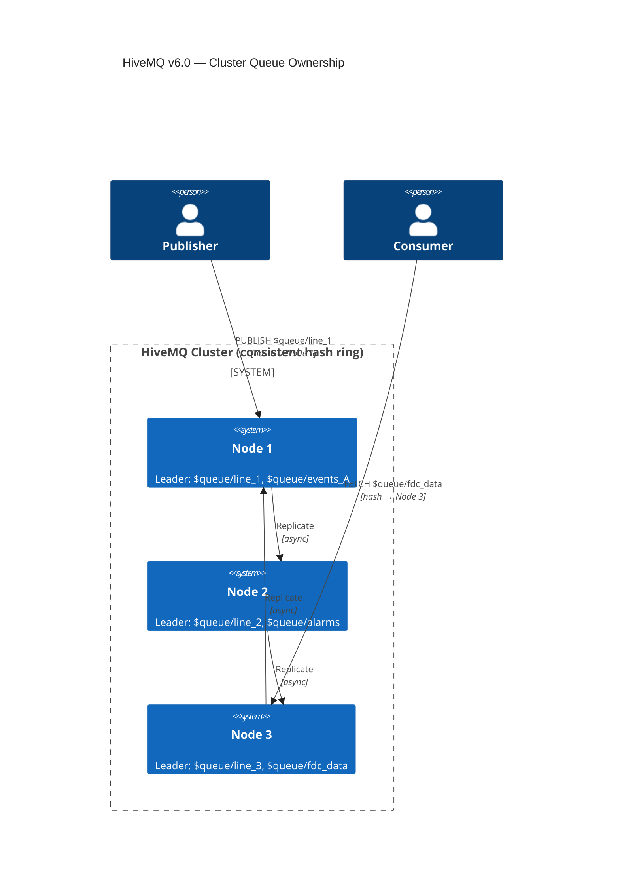
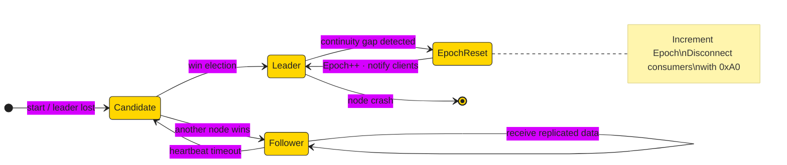
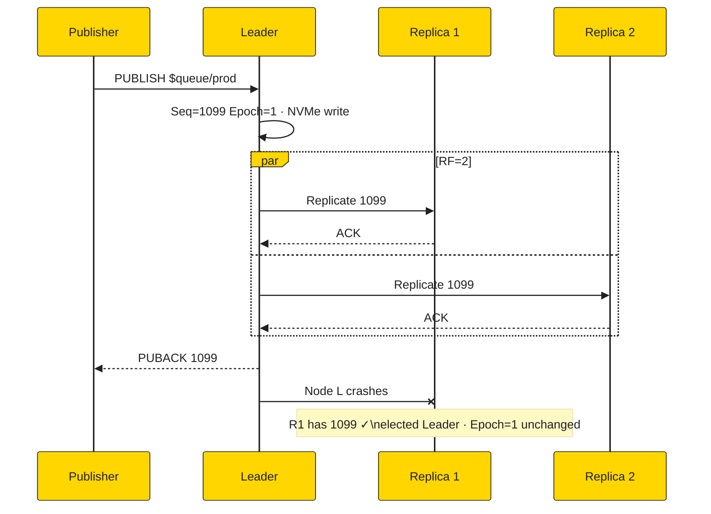
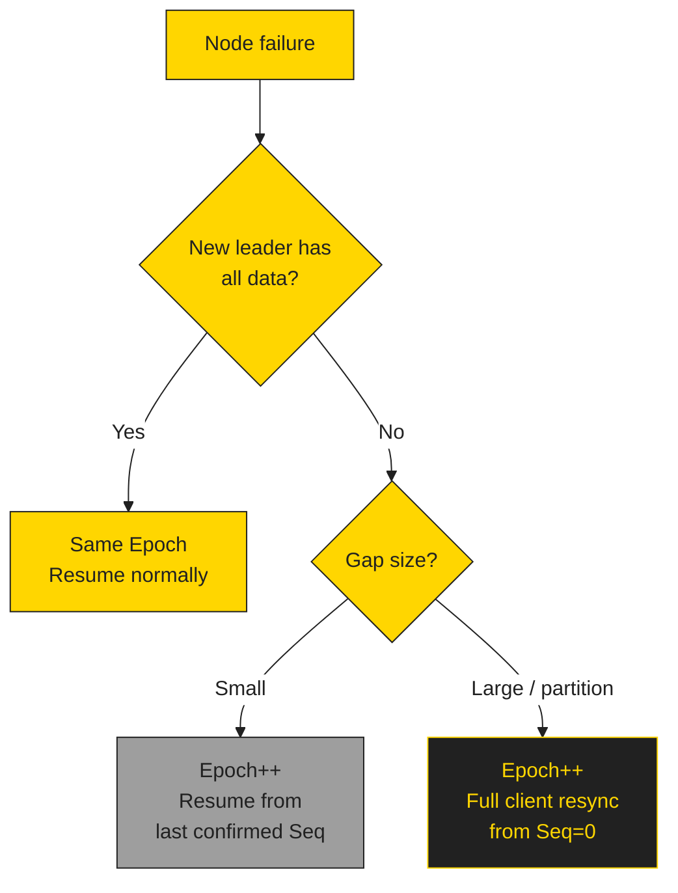
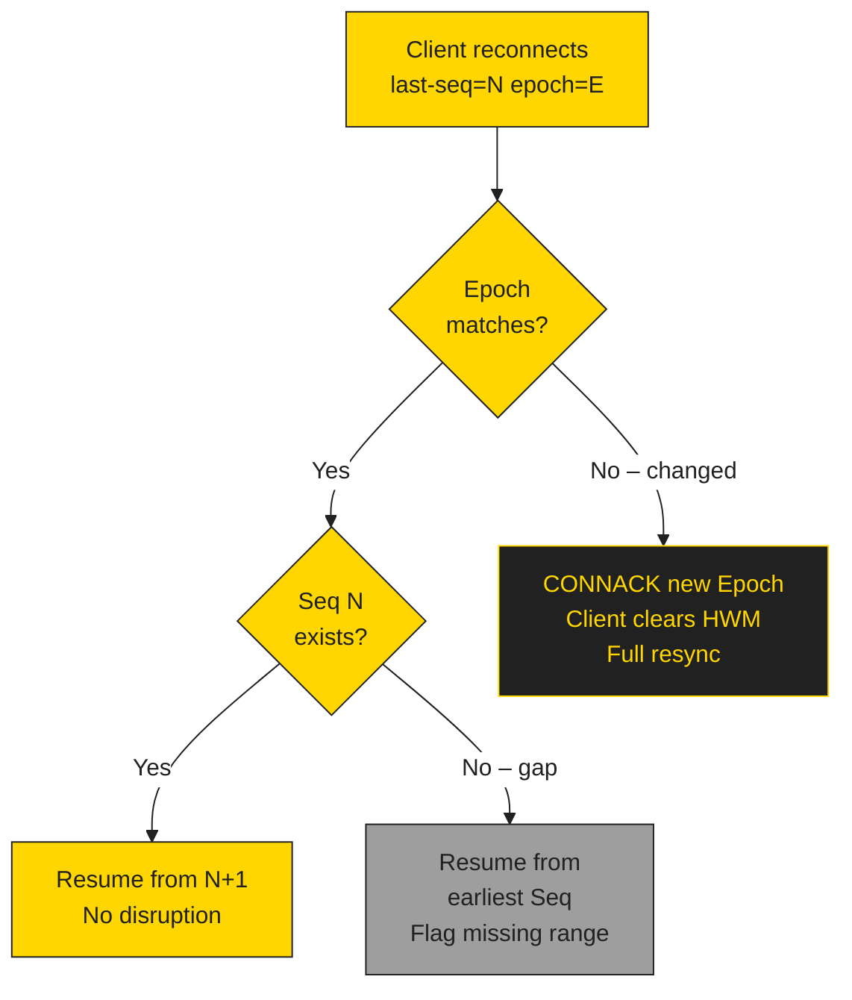
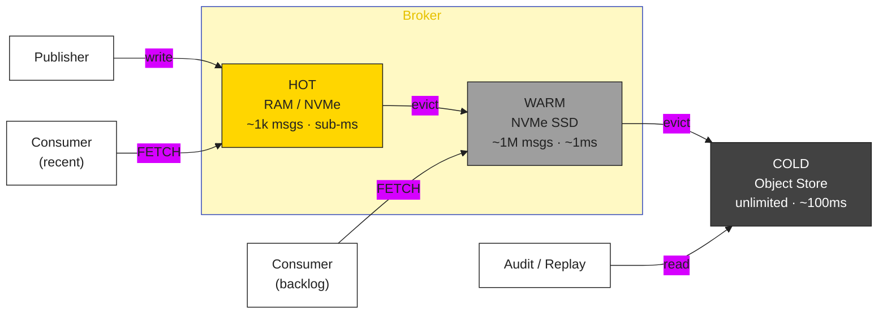
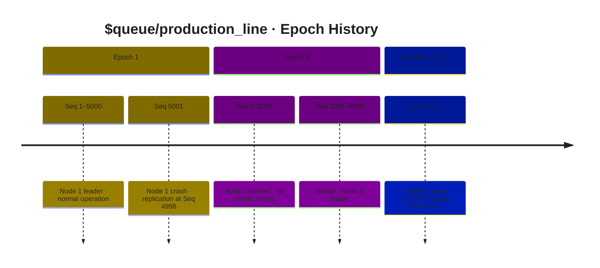

# Cluster Failover & Epoch Management Diagrams

---

## 1. Cluster Queue Ownership (C4)

---

## 2. Leader Node State Machine

---

## 3. Quorum Replication

---

## 4. Failover Decision Tree

---

## 5. Client Reconnect Decision Tree

---

## 6. Tiered Storage

---

## 7. Epoch Timeline

