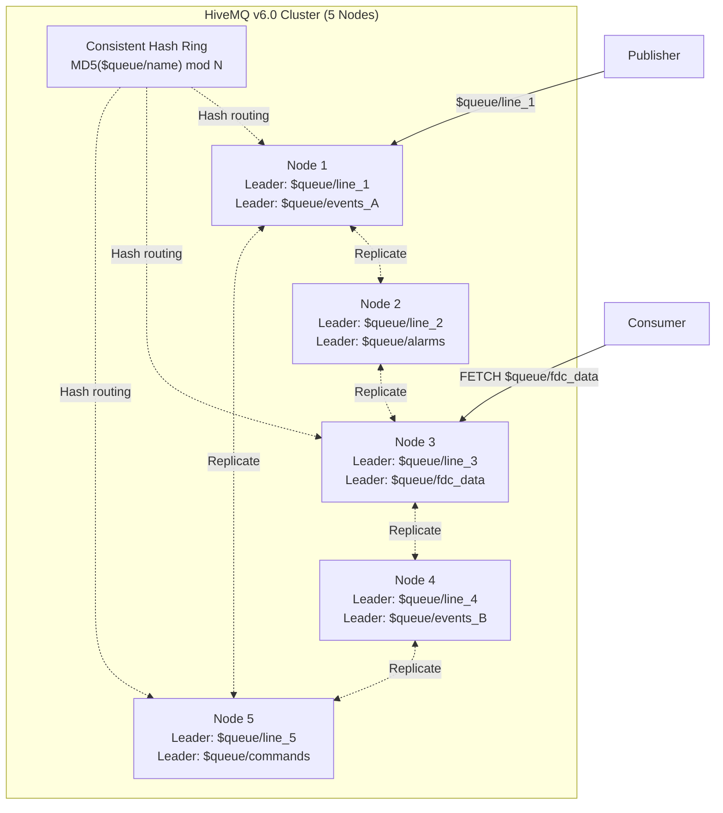
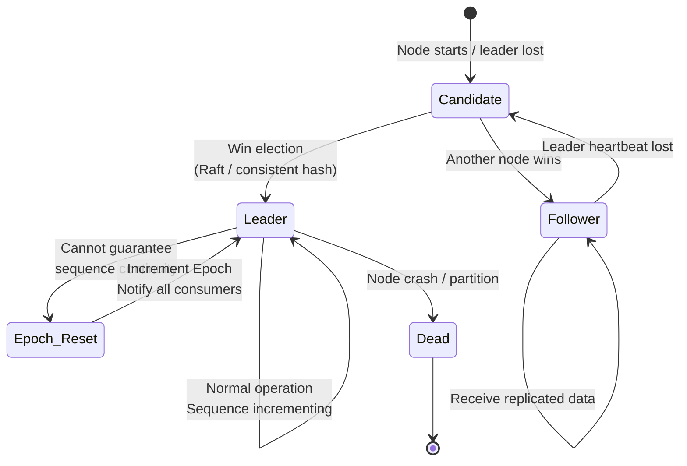
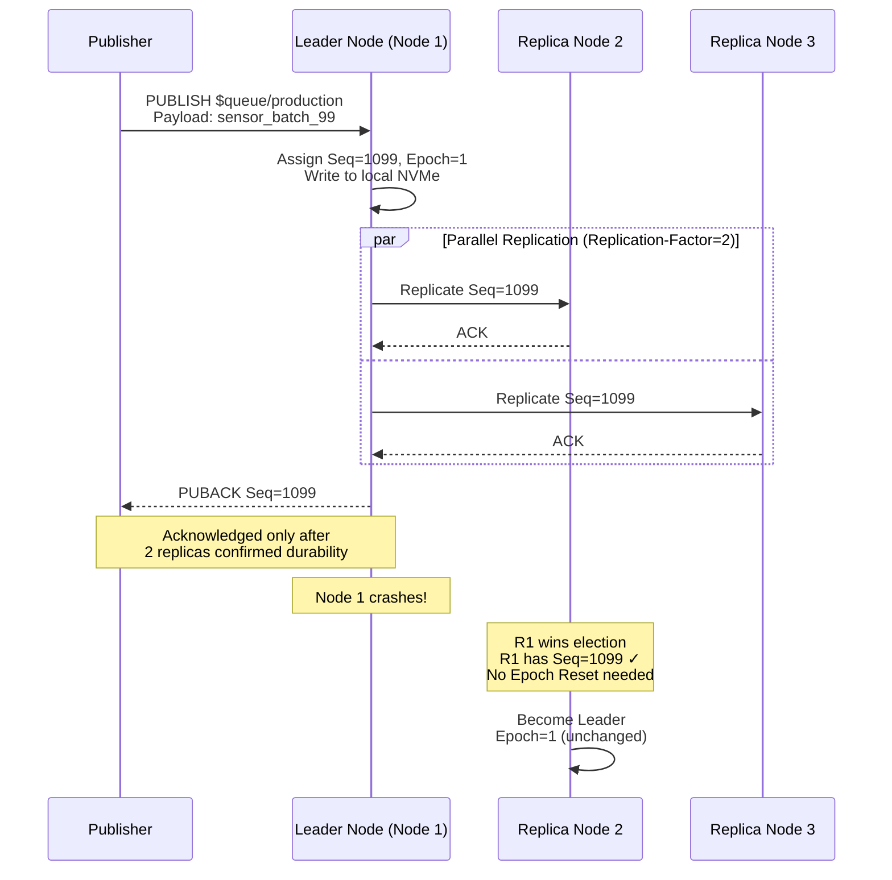
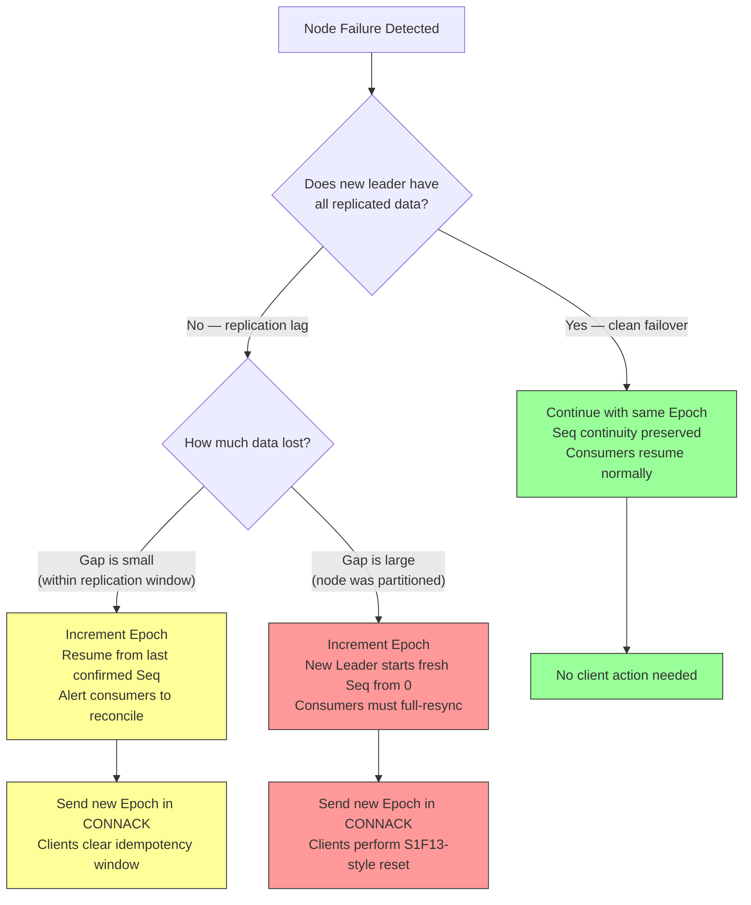
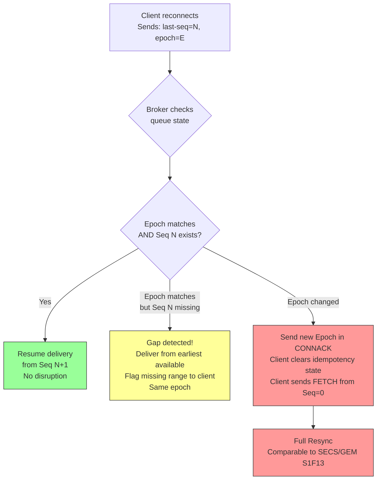
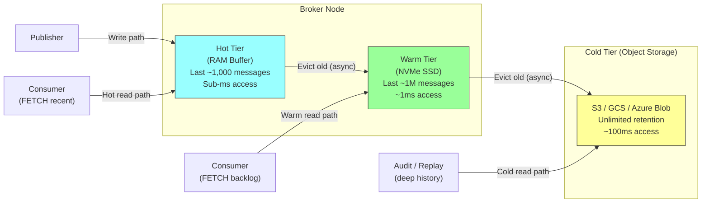
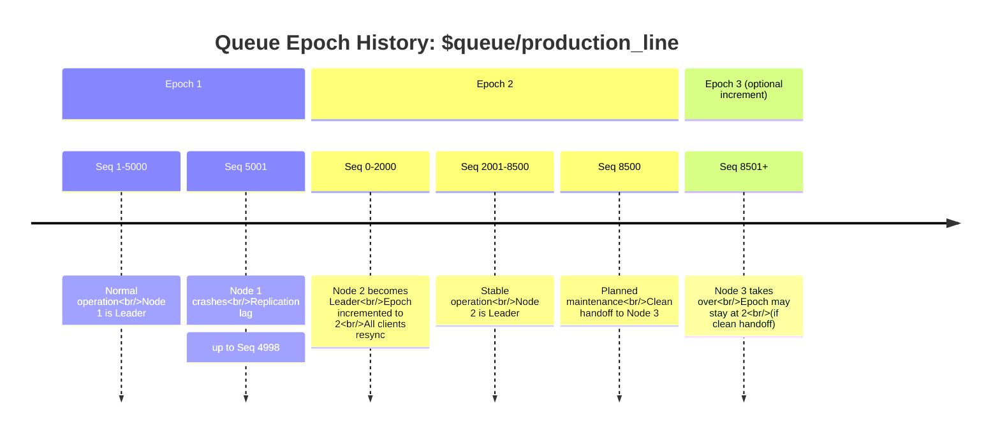

# Cluster Failover & Epoch Management Diagrams

---

## 1. HiveMQ Shared-Nothing Cluster: Queue Ownership

---

## 2. Leader Election State Machine

---

## 3. Replication and Quorum Acknowledgement

---

## 4. Failure Scenarios and Outcomes

---

## 5. Client Reconnect Decision Tree

---

## 6. Tiered Storage Model for Persistent Queues

---

## 7. Epoch Timeline

