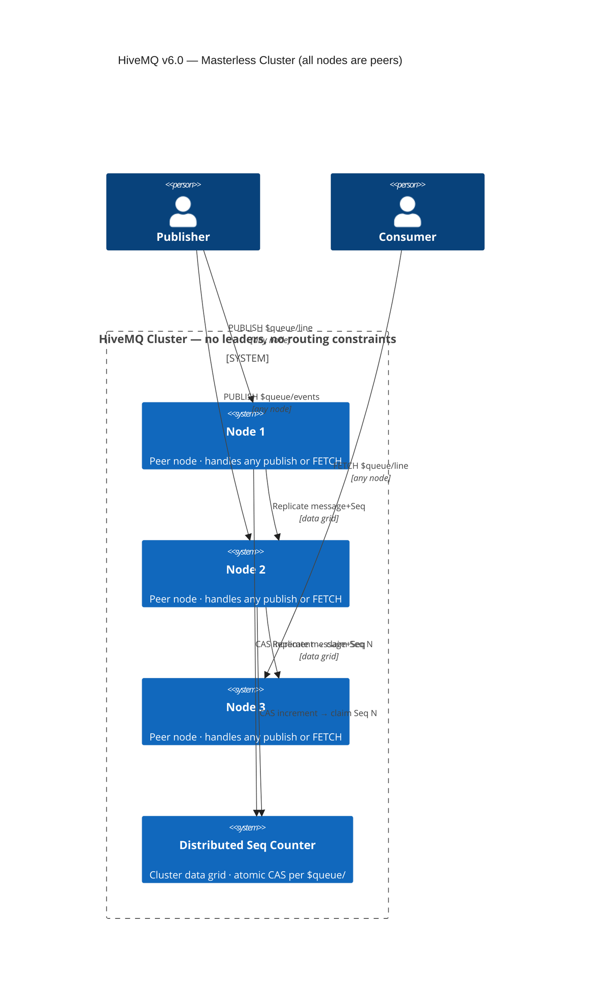
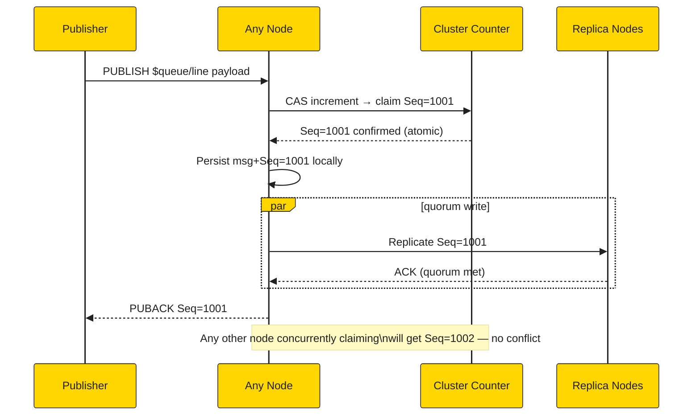
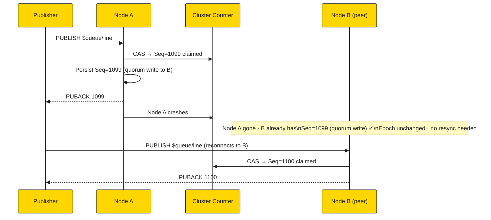
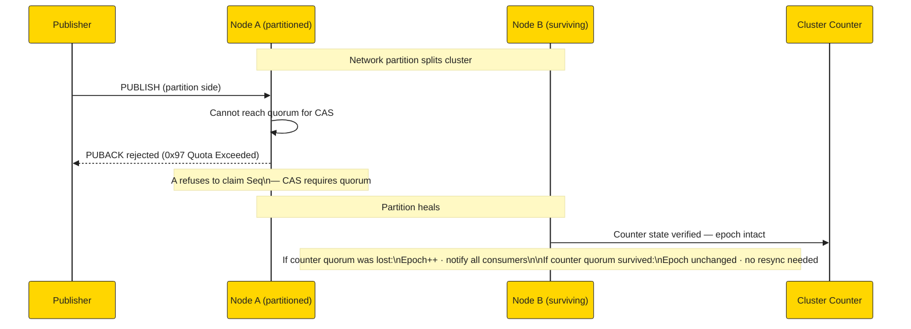
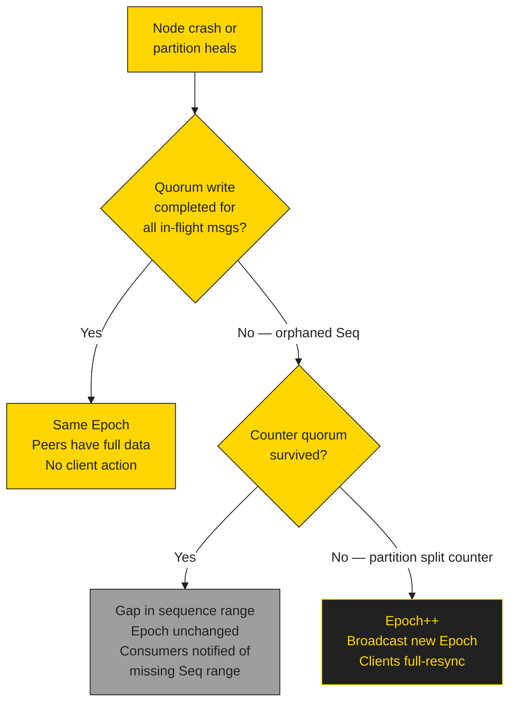
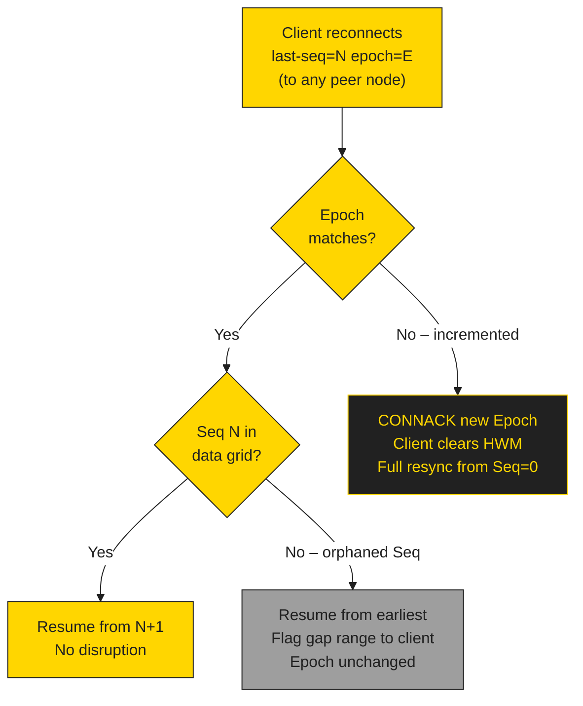
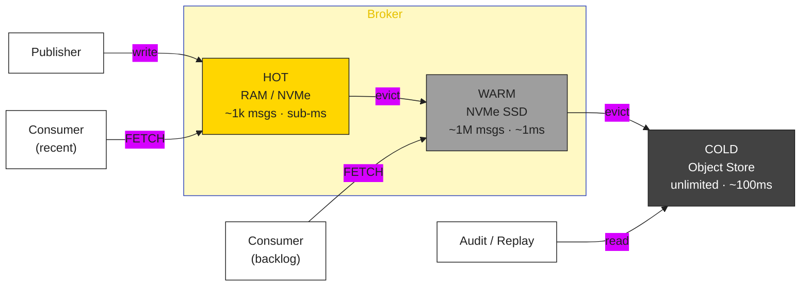
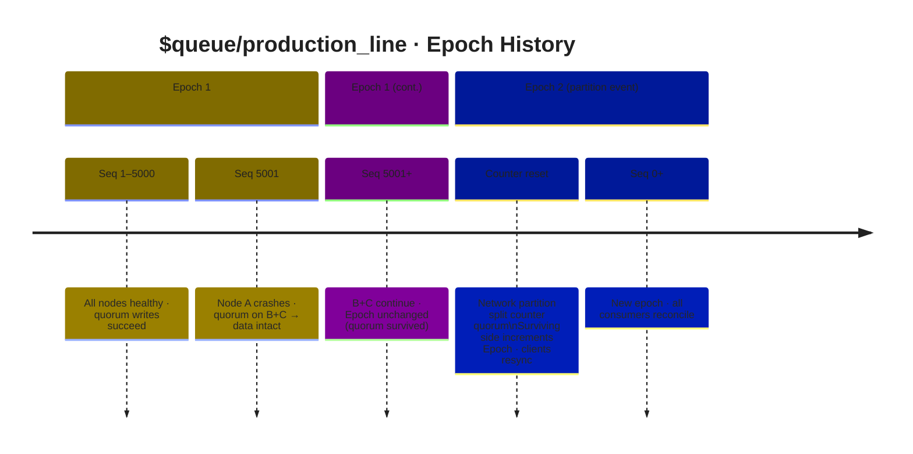

# Cluster Failover & Epoch Management Diagrams

> **Architecture note:** HiveMQ is a **masterless, shared-nothing cluster** — all nodes are peers with no permanent leaders and no consensus protocol (Raft/Paxos). Sequence monotonicity is guaranteed by a **Distributed Sequence Counter** (atomic CAS) in HiveMQ's replication data grid, not by sticky routing to a leader node.

---

## 1. Masterless Cluster — Any Node Sequences Any Publish (C4)

---

## 2. Sequence Assignment — Distributed Counter (No Leader Required)

---

## 3. Node Crash — No Leader Election Required

---

## 4. Partition Event — When Epoch Increments

---

## 5. Failure Outcomes Decision Tree

---

## 6. Client Reconnect Decision Tree

---

## 7. Tiered Storage

---

## 8. Epoch Timeline

