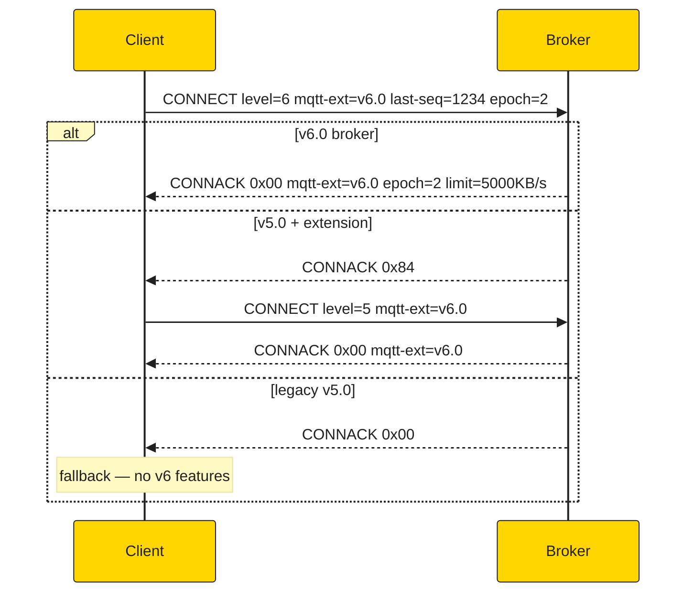
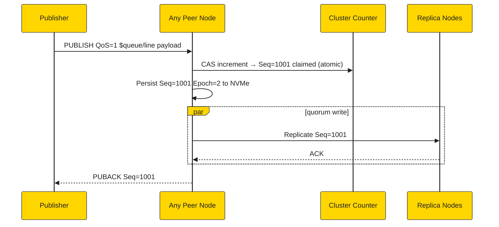
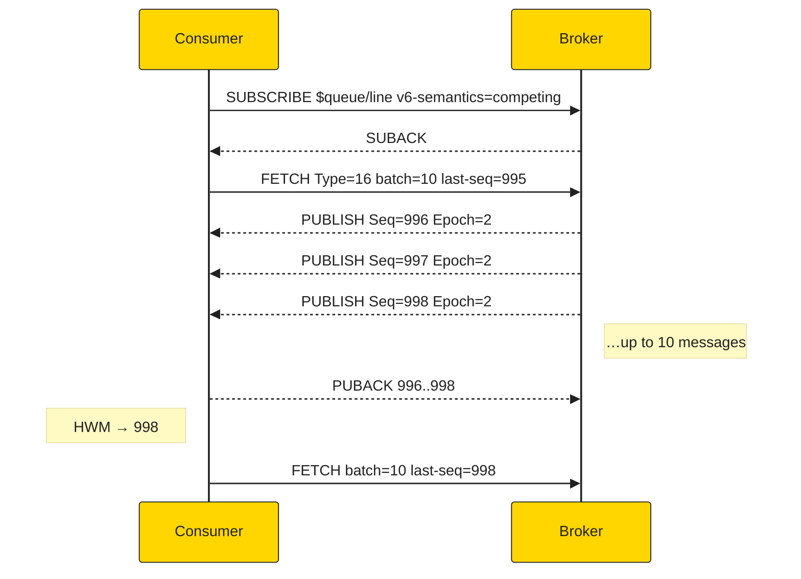
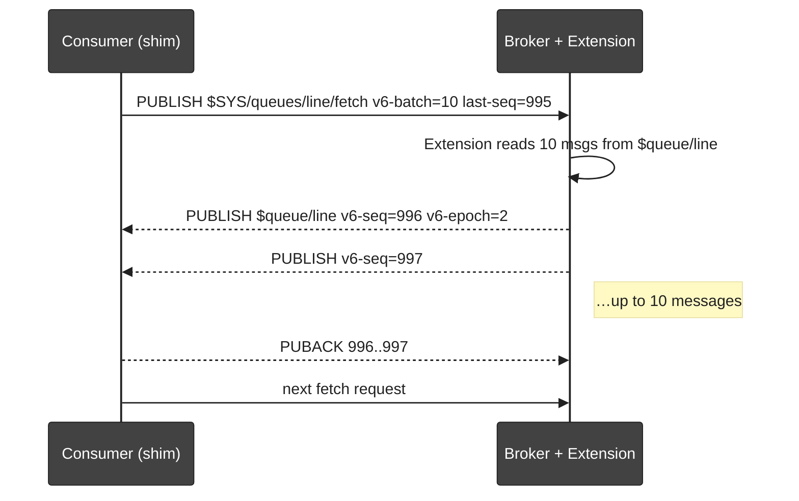
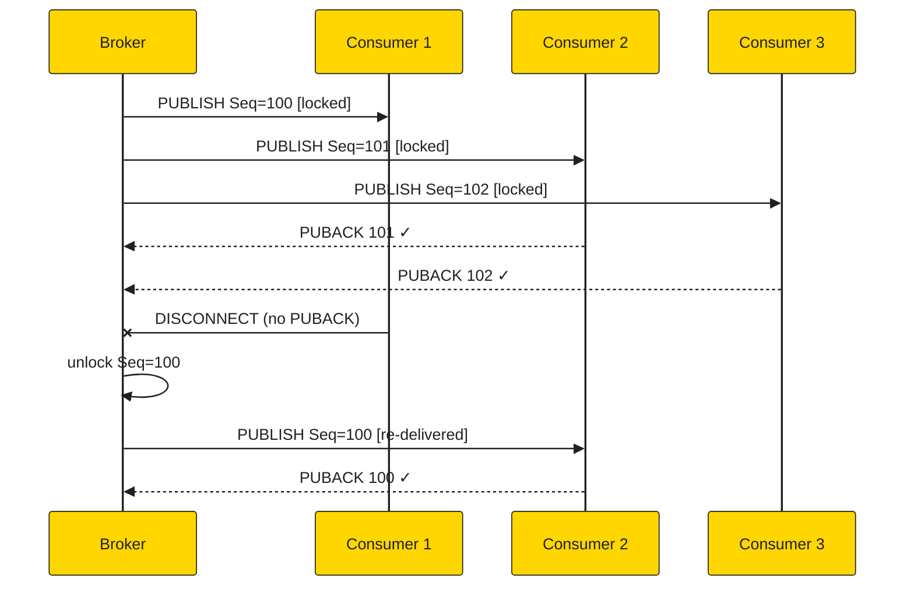
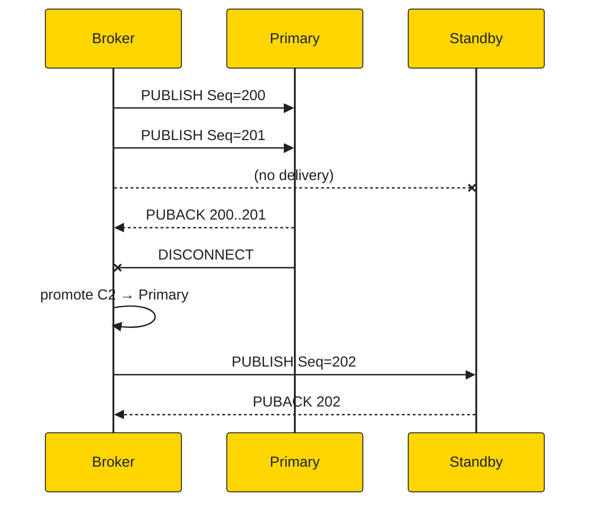
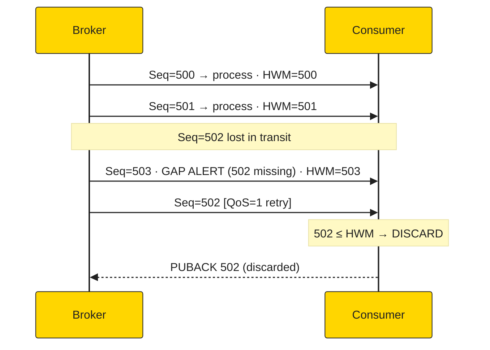
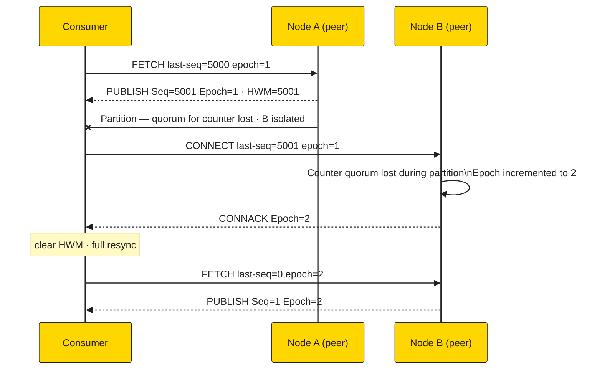

# MQTT v6.0 Packet Flow Diagrams

---

## 1. Connection Negotiation

---

## 2. Publish → Sequence Assignment (masterless)

---

## 3. Native FETCH (Protocol Level 6)

---

## 4. Virtual FETCH (Compat Mode)

---

## 5. Competing Consumer — Failover

---

## 6. Exclusive Consumer — Hot-Standby

---

## 7. Gap Detection + Exactly-Once

---

## 8. Epoch Reset on Cluster Failover

