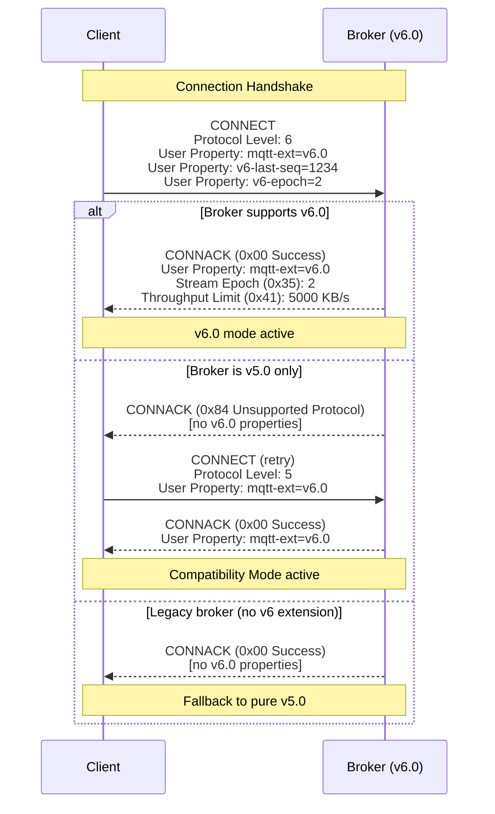
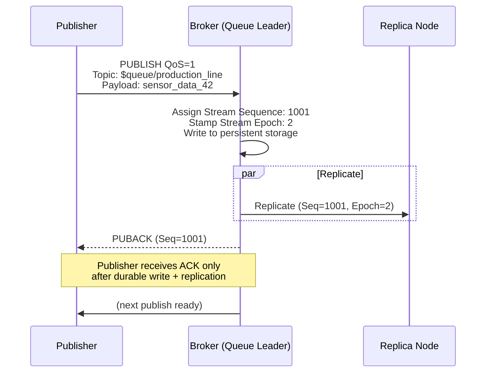
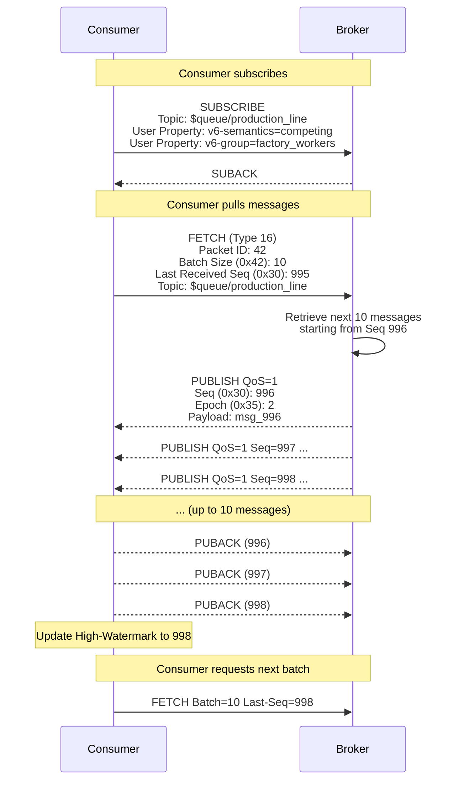
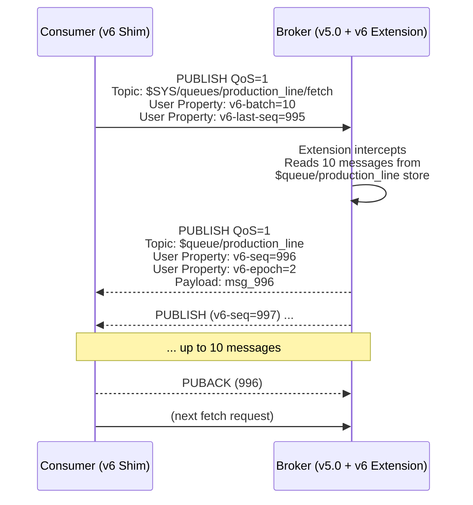
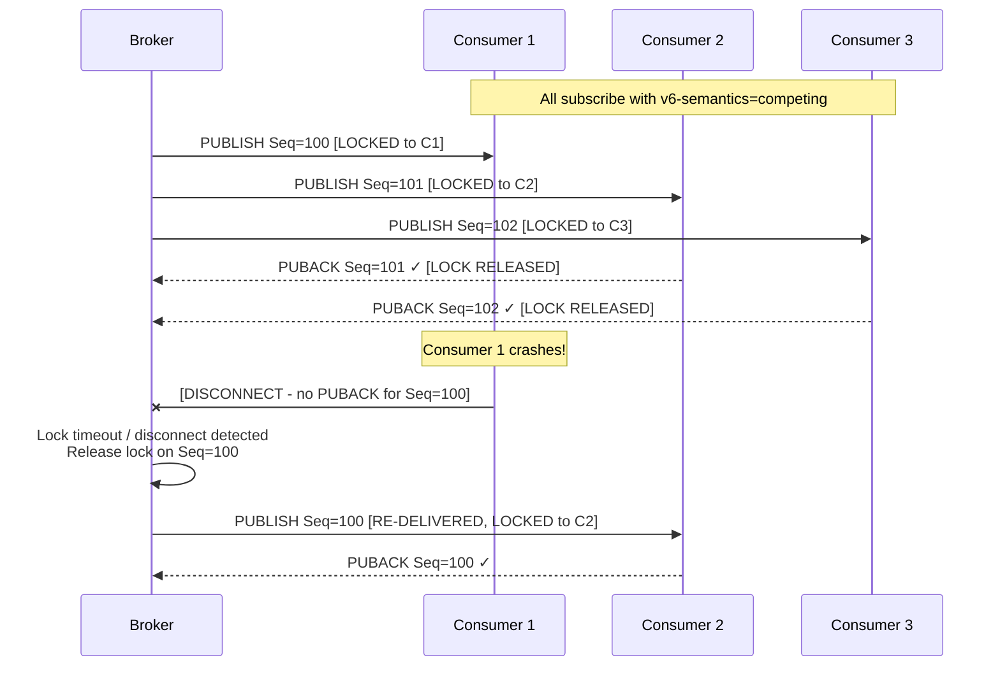
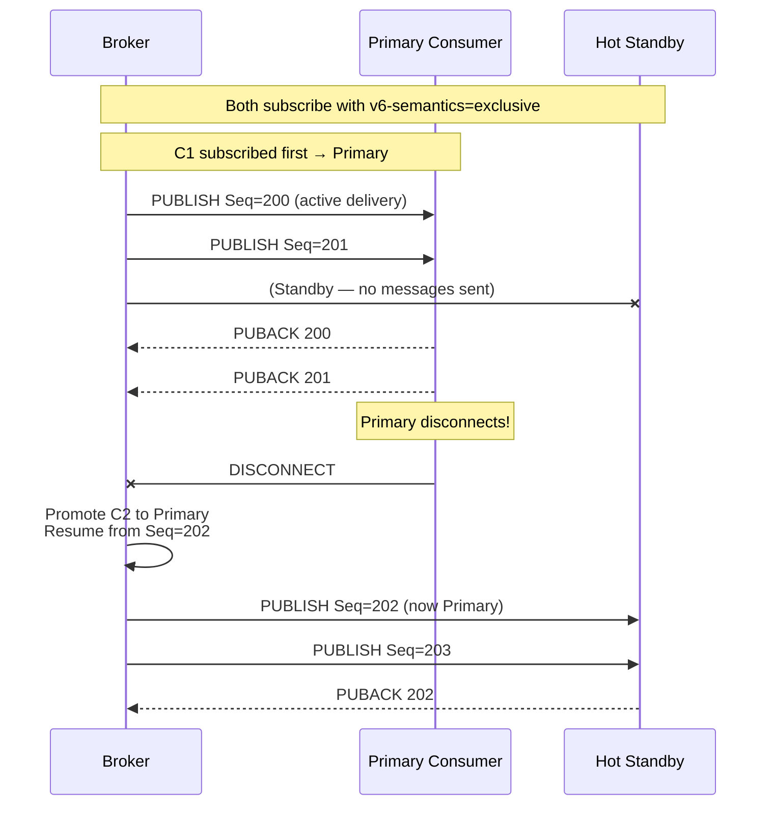
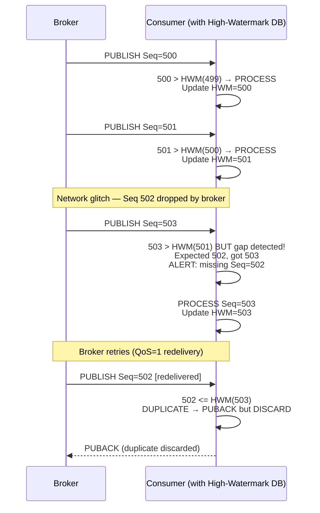
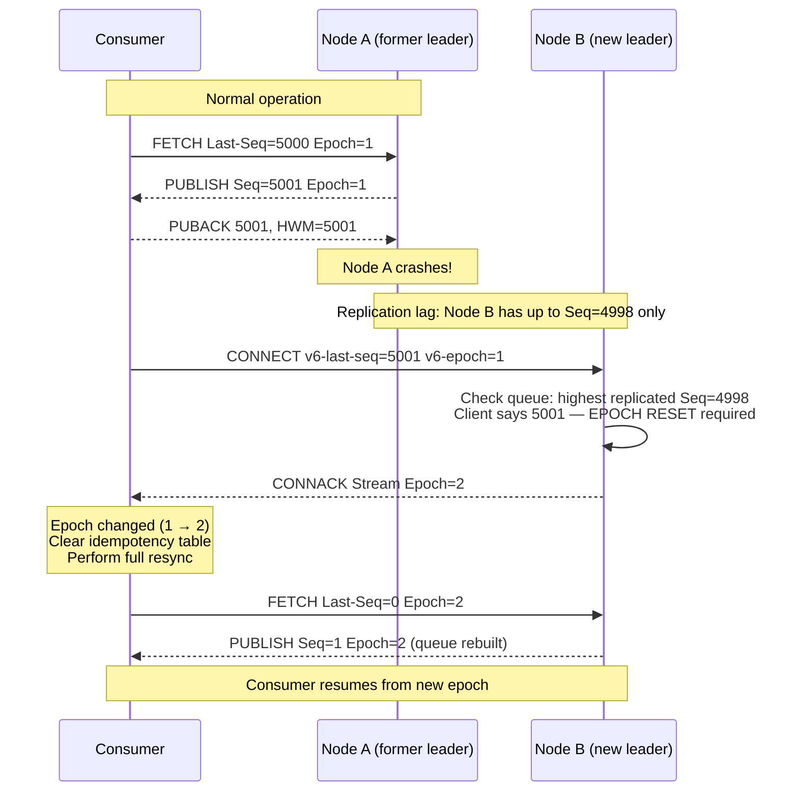

# MQTT v6.0 Packet Flow Diagrams

---

## 1. v6.0 Connection Negotiation

---

## 2. Publish to `$queue/` — Sequence Assignment

---

## 3. Native FETCH Flow (Protocol Level 6)

---

## 4. Virtual FETCH Flow (Compatibility Mode — v5.0 Broker + Extension)

---

## 5. Competing Consumer — Message Locking and Failover

---

## 6. Exclusive Consumer — Hot-Standby Failover

---

## 7. Gap Detection and Exactly-Once Processing

---

## 8. Epoch Reset During Cluster Failover

